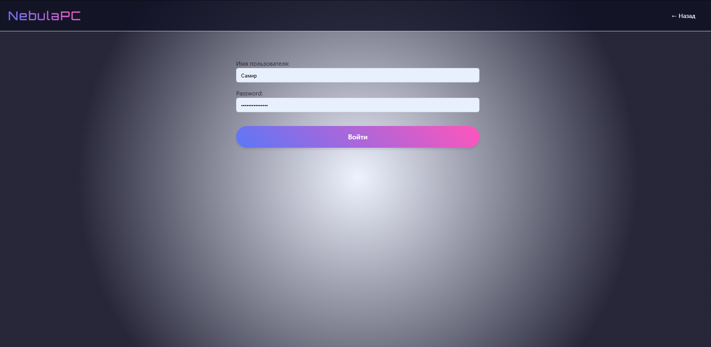
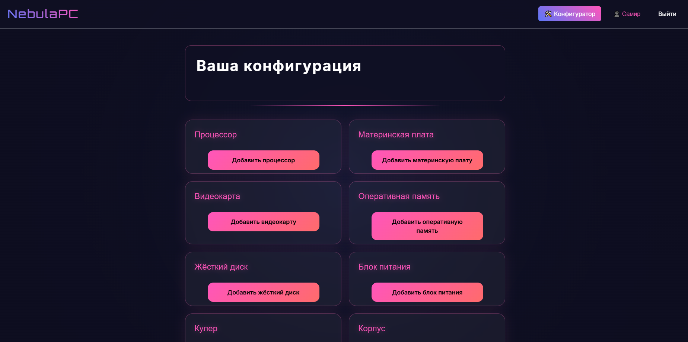
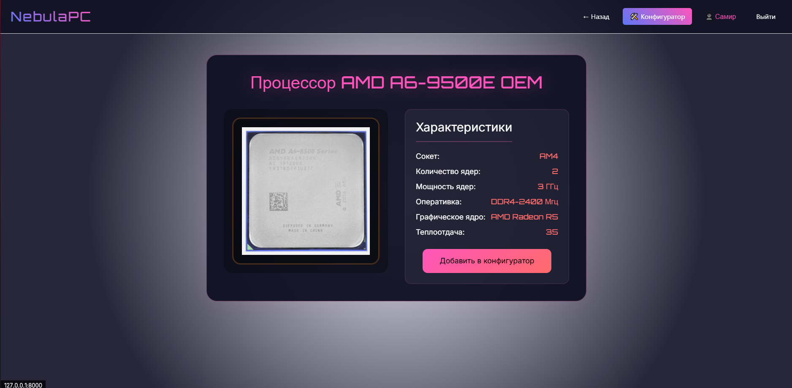
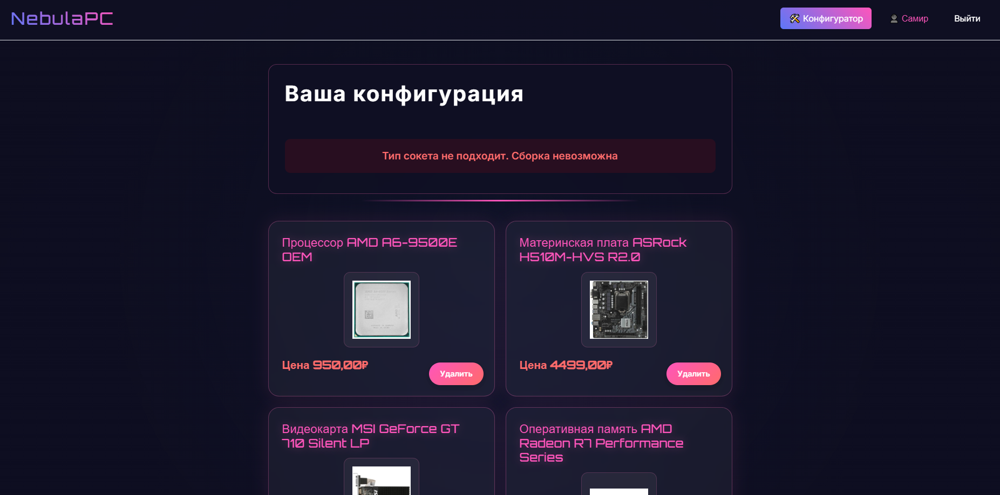
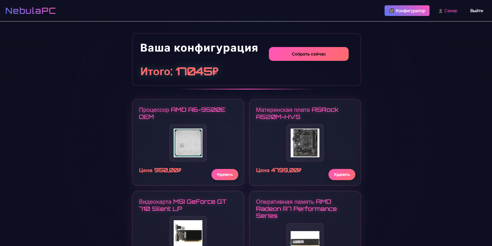
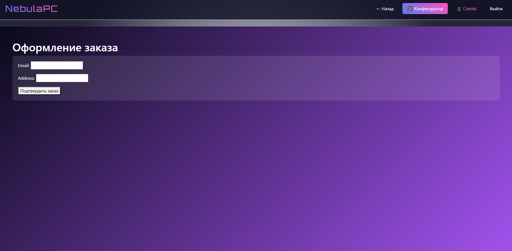
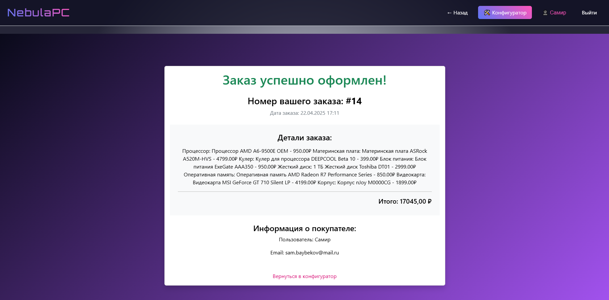

# 🖥️ PC Configurator — Онлайн-конфигуратор сборки ПК

[](https://www.djangoproject.com/)
[](https://getbootstrap.com/)
[](LICENSE)

**Умный конструктор для подбора совместимых компонентов ПК с автоматической проверкой и расчётом стоимости**  
[Демо проекта](https://github.com/MrUlkiNov/PC_Configurator.git) | [Исходный код](https://github.com/MrUlkiNov/PC_Configurator.git)

---

## ✨ Особенности
- 🧩 Пошаговая сборка конфигурации (ЦПУ, GPU, материнские платы и др.)
- ✅ Автоматическая проверка совместимости компонентов
- 💰 Расчёт общей стоимости системы в реальном времени
- 📊 Сравнение характеристик комплектующих
- 📥 Сохранение/загрузка конфигураций в профиле
- 🛠️ Режим эксперта (ручной подбор с фильтрами)
- 📱 Адаптивный интерфейс с 3D-превью сборки

---

## 🛠 Технологии
| Категория       | Стек                          |
|-----------------|-------------------------------|
| **Backend**     | Django 5.1.7                  |
| **Frontend**    | Bootstrap 5, Chart.js, Crispy Forms |
| **База данных** | SQLite |
| **Дополнительно**| Pandas (анализ совместимости), Celery |

---

## 🚀 Быстрый старт

### 1. Клонирование репозитория
```bash
git clone https://github.com/MrUlkiNov/PC_Configurator.git
cd PC_Configurator
```
### 2. Настройка виртуального окружения
```bash
python -m venv venv
# Активация:
# Windows:
venv\Scripts\activate
# Linux/Mac:
source venv/bin/activate
```
### 3. Установка зависимостей
```bash
pip install -r requirements.txt
```

### 4. Создание .env файла
```bash
SECRET_KEY=ваш_секретный_ключ
DEBUG=True
ALLOWED_HOSTS=localhost,127.0.0.1
```
### 5. Применение миграций
```bash
python manage.py migrate
```
### 6. Создание суперпользователя
```bash
python manage.py createsuperuser
```

### 7. Запуск сервера
```bash
python manage.py runserver
```
Откройте в браузере: http://localhost:8000

---
## 📂 Структура проекта

```
PC_configurator/
├── PC_Configurator/     # Основное приложение
│   ├── migrations/      # Миграции БД
│   ├── templates/        
│   ├── static/          # CSS, JS, изображения
│   ├── models.py        # Модели (игры, корзина, пользователи)
│   └── views.py         # Логика страниц
├── pc_builder/          # Настройки проекта
├── .gitignore           # Игнорируемые файлы
└── requirements.txt     # Зависимости
```
---
## ⚙️ Конфигурация
Настройки Crispy Forms
```python
CRISPY_TEMPLATE_PACK = 'bootstrap5'
```
Доступ к медиафайлам
Убедитесь, что в urls.py добавлено:
```python
from django.conf import settings
from django.conf.urls.static import static

urlpatterns += static(settings.MEDIA_URL, document_root=settings.MEDIA_ROOT)
```

---

## 📸 Скриншоты интерфейса
| Форма входа | Авторизация | Главное окно | 
|-------------|-------------|--------------|
|  |  |  |
| Список запчастей | Карточка запчасти | Ошибка сборки |
|------------------|-------------------|---------------|
|  |  |  |

| Успешная сборка | Форма оформления | Создание заказа |
|-----------------|------------------|-----------------|
|  |  |  |

---

## 🔧 Возможные проблемы
Ошибка активации venv в PowerShell
```bash
Set-ExecutionPolicy RemoteSigned -Scope CurrentUser
```

Нет доступа к изображениям игр
Проверьте:

Наличие папки media/ в корне проекта.

Настройки в urls.py (см. раздел Конфигурация).

Ошибка "No module named 'crispy_forms'"
```bash
pip install django-crispy-forms==2.4
```
---

📄 Лицензия
Проект распространяется под лицензией MIT.
---
Автор: MrUlkiNov
📧 Email: sam.baybekov@mail.ru
🔗 GitHub: MrUlkiNov
---
